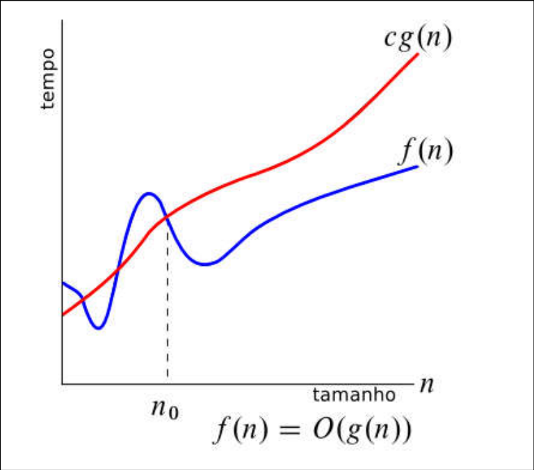
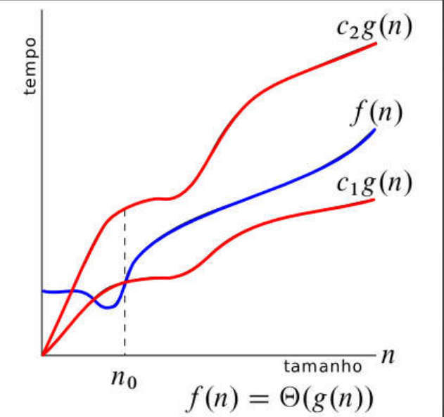

<style>
  img[alt=Taxa-de-Crescimento] {width: 600px;}
  img[alt=Big-O] {width: 400px;}
  img[alt=Big-Theta] {width: 400px;}
  img[alt=Big-Omega] {width: 400px;}
</style>

# Análise Assintótica

## Índice
 - [Introdução](#introdução)
 - [3 Casos da função AlteraX](#3-casos-desse-algoritmo)
   - [Informações Gerais](#informações-gerais)
   - [Pior caso](#pior-caso)
   - [Melhor Caso](#melhor-caso)
   - [Caso Médio](#caso-médio)
   - [Conclusão da Análise](#conclusão-da-análise)
 - [Big O](#big-o)
 - [Big $\Theta$](#big-theta-theta)
 - [Big $\Omega$](#big-omega-omega)
 - [Little $\omega$ e Little o](#little-omega-omega-e-little-o-o)
 - [Conclusão](#conclusão)
 - [Continuação](#continuação)

## Introdução

Tendo um modelo computacional bem definido e sabendo o peso de cada operação em instruções, é possível comparar algoritmos e, mais precisamente, suas quantidades de instruções dada uma determinada entrada.

Para isso, alguns conceitos são usados para definir os limites que os algoritmos alcançam. Para explicação dos conceitos, será usado como base o seguinte trecho de código em C:

```C
1  void alteraX(int entrada) {
2    
3     int x = 0;
4
5     for (int i = 0; i < entrada; i++) {
6        
7         // vai executar sempre
8         x = i;
9
10        // vai executar quando a entrada for maior que 100
11        if (entrada > 100) {
12            j = i;
13        }
14
15     }
16
17 }
```

O que essa função faz, em suma, é armazenar o valor de i a cada iteração do laço for, sendo que i terá valores de $\color{lightblue}{~0~}$ até $\color{lightblue}{~\textrm{o valor de entrada}}$.

Note que não é feita nenhuma verificação do valor da entrada, o que significa que o valor de entrada pode ser nulo ou até negativo. Isso será importante nos próximos tópicos.

A quantidade de instruções que esse algoritmo executará depende do tamanho da entrada e da forma como ela está organizada. Sendo assim, no próximo tópico será demonstrado os 3 casos estudados no arquivo [Complexidade de Tempo](./1_ComplexidadeDeTempo.md).

## 3 Casos da função _AlteraX_

### Informações Gerais

É importante perceber que a linha 8 vai executar em __todos os casos__, sem exceção; Porém, na linha 11 existe uma estrutura condicional _IF_. Isso significa que a função só entrará dentro do escopo dessa estrutura se a condição que estiver dentro dos parênteses do _IF_ for verdadeira. Caso não seja, todo o escopo da estrutura é desconsiderado e a função continua à partir da próxima iteração.

```C
    for (int i = 0; i < entrada; i++)
```

Também é importante perceber que a estrutura _FOR_ é composta por:
 - declaração e inicialização, que são opcionais (```(int i = 0;```)
 - verificação ou condição de parada (```i < entrada;```)
 - incremento (```i++)```).

Dessa forma, as estruturas de repetição também têm instruções que precisam ser contabilizadas para o resultado da comparação ser o mais próximo possível do real.

Uma última informação importante antes da análise: geralmente é analisado o Pior Caso do algoritmo, já que nesse caso será executada a maior quantidade de instruções de todas, fazendo assim com que todos os outros casos tenham uma quantidade igual ou menor do que a do Pior Caso.

### Pior Caso

O que é necessário que ocorra para que o algoritmo entre no Pior caso?

Analisando por parte, é possível perceber que a linha 3 vai rodar uma única vez; então,nesse início, o __total de instruções__ é 1.

Dentro do _FOR_ há a inicialização da variável _i_, que também só ocorrerá uma única vez, que acontece na primeira vez que a linha 5 é lida. Assim, __total de instruções = 2__. Logo após a inicialização, existe a verificação de parada do _FOR_ que rodará um total de vezes igual ao valor de entrada. Isso significa que, caso a entrada seja 5, essa condição será verificada 5 vezes. Sendo assim, __total de intruções = 2 + _entrada___.

A próxima parte do _FOR_ também vai rodar _entrada_ vezes. A cada vez que a condição é verificada e não é satisfeita, o valor de i é incrementado em 1. Com isso, o __total de instruções = 2 + _entrada_ + _entrada___ ou 2 + 2 * _entrada_.

A linha 8 vai executar sempre e será executada _entrada_ vezes, já que se encontra dentro da função _FOR_. Então, __total de instruções = 3 $\bf{entrada}$ + 2__.

A linha 11 será executada _entrada_ vezes também, pois à cada iteração essa verificação condicional será feita. __Total de instruções = 4 $\bf{entrada}$ + 2__

Por fim, a linha 12 da função é a última linha com alguma instrução a ser executada, porém só será executada caso a condição dentro do _IF_ for verdadeira. Isso vai depender da entrada de cada execução do programa; porém, como essa análise está sendo feita visando o Pior Caso e é buscado o maior número de instruções que esse algoritmo irá rodar, a entrada nesse caso será maior que 100. __Não importa o valor exato que a entrada seja__, só é importante que o escopo do _IF_ seja executado.

Portanto, a linha 12 também rodará _entrada_ vezes. Por fim:

__Total de instruções = 5 $\bf{entrada}$ + 2__.

Isso significa que, caso a entrada seja 500, a função executará __2502__ instruções.


### Melhor Caso

No melhor caso, a quantidade de instruções se manterá igual ao Pior Caso até a linha 12, já que só há uma condicional com base na entrada na linha 11.

Sendo assim: __Total de instruções = 4 $\bf{entrada}$ + 2__ por enquanto.

O melhor caso ocorrerá quando a entrada for menor que 100, para __qualquer__ entrada menor que 100. Sendo assim, caso a entrada seja menor que 100, a linha 11 terá uma condição falsa e, portanto, o programa não executará o escopo do _IF_.

Como depois dessa estrutura não há mais nenhuma instrução nova para ser analisada, o __total de instruções é igual à 4 $\bf{entrada}$ + 2__.

Caso a entrada seja 50, a função executará __202__ instruções.

### Caso Médio

O caso médio, nessa função, é complicado de ser encontrado já que só temos uma estrutura condicional e um valor para entrada. Nessa mesma pasta será colocado um documento explicando alguns casos com algoritmos de ordenação, que são mais fáceis de serem analisados.

## Conclusão da Análise

Nesse algoritmo, a análise retornou que: 
 - Pior caso = 5 $\bf{entrada}$ + 2;
 - Melhor caso = 4 $\bf{entrada}$ + 2.

O caso médio não será necessário por agora, então é possível prosseguir. Antes, serão apresentados outros pontos que são importantes para entender as notações que virão a seguir.

Primeiro, todas os exemplos que serão apresentados usam como variável de entrada a letra _n_ que tem o mesmo objetivo da nossa variável _entrada_. Geralmente,quando é-se estudado funções que recebem um único valor inteiro como parâmetro, é utlizado a variável _n_ para definir os limites do algoritmo; porém esse parâmetro pode variar com algoritmos mais complexos e com diferentes parâmetros. Por exemplo: um algoritmo que depende de dois valores inteiros - _v_ e _a_ - que são independentes um do outro pode ter uma notação baseada em _v_ e _a_, como (2v + a) ou ($v^a$).$\newline$
Sendo assim, a partir desse momento será usada a letra _n_ para se referir à entrada.

Em segundo lugar, geralmente os algoritmos analisados retornam uma função polinomial, ou seja, um valor de $\bf{c \cdot entrada^k}$. No caso apresentado, a constante C corresponde à 5 ou 4, dependendo do caso, e a entrada é elevada à 1.

Geralmente é levado em consideração somente o maior termo da função, caso esteja sendo feita uma análise simples para fins educacionais. É comum também desconsiderar constantes escalares que multiplicam o termo _n_. No caso apresentado, dizer que o algoritmo é linear (porque é apresentado um _n_ elevado à 1) é correto, uma vez que é desconsiderado o valor C e o valor _2_ somado à função.

Por fim, a imagem abaixo mostra um algumas das funções polinomiais. É interessante notar como cada uma se comporta e que, em todas elas, quanto maior o valor, maior é o valor em Y. Todas começam bem próximas, mas, conforme o valor de x aumenta, mais diferente é o crescimento das funções.


Com isso em mente, o próximo tópico mostrará brevemente o que significa o Big O de uma função.

## Big O

> Exemplo: O(n).

A notação/classe _Big O_ representa o limite máximo queo algoritmo pode alcançar. No caso analisado, é possível dizer que o algoritmo é __O(n)__. No pior caso, que é quando ocorre o maior número de instruções, a função crescerá tão rápido quanto uma função _n_.

Essa notação pode ser lida como: _A função cresce mais devagar ou em mesmo ritmo que n_. Por esse motivo, é usada como principal atributo comparativo entre algoritmos.

Caso queira comparar dois algoritmo que têm o mesmo objetivo, o modo mais rápido de ver qual é mais eficiente é observar se algum deles tem mais instruções no pior caso, já que o melhor caso com certeza vai ter uma quantidade menor ou igual de instruções.

> é possível dizer que o algoritmo pertence também à O($n^2$), O(n!) e qualquer outra função que cresça mais que n, já que a ideia é somente dar um "teto" na função.

Na imagem a seguir, é mostrado um exemplo de função que pertence à O(n). A função em análise é f(n), que pertence à O(g(n)). Perceba que, após o $n_0$, a função f(n) sempre tem um valor menor do que a função g(n), como se fosse um "teto".



A constante C representa um valor constante que multiplica a função _g(n)_ e faz com que ela seja maior que f(n). Essa constante __deve__ ser maior que 0.

Explicação formal: Existem constantes positivas $c$ e $n_0$ tais que $0 \leq f(n) \leq c \cdot g(n)$, para todo $n \geq n_0$

Resumindo: O(n) significa que a função irá crescer menos ou igual à _n_ à partir de um ponto $n_0$. É o máximo que a função vai atingir.

## Big Theta ($\Theta$)

> Exemplo: $\Theta(n)$

A classe Big $\Theta$ delimita limites superiores e inferiores à função.

Na imagem abaixo é mostrada uma função com $\Theta(n)$. Isso significa que a função crescerá no mínimo igual à $c_1g(n)$ e não ultrapassará o valor de $c_2g(n)$ após um determinado valor, também chamado de $n_0$.



Explicação formal: Existem constantes positivas $c_1$, $c_2$ e $n_0$ tais que $0 \leq c_1 \cdot g(n) \leq f(n) \leq c_2 \cdot g(n)$, para todo $n \geq n_0$.

Resumindo: A função f(n) é "prensada" por funções iguais, mas com constantes diferentes, de tal forma que a f(n) vai crescer junto com essas funções.

No exemplo estudado, é possível dizer que $\Theta(n)$, uma vez que o valor mínimo de instruções (melhor caso) tem crescimento igual à _n_ e, no caso com maior número de instruções(pior caso), também tem crescimento igual à _n_.

Podemos, por exemplo, dizer que $c_1 = 0.5$ e $c_2 = 2$. Dessa forma, ao verificarmos a função, percebemos que $0.5n \leq n \leq 2n$, provando assim que $\Theta(f(n)) = \Theta(n)$.

Não é tão utilizada, geralmente só é verificado o Big O da função.

## Big Ômega ($\Omega$)

> Exemplo: $\Omega(n)$

Por fim, a notação Big $\Omega$ dá um limite inferior para f(n). Na imagem abaixo, é possível notar que, após $n_0$, $f(n)$ nunca é menor que $c \cdot g(n)$.


Explicação formal: Existem constantes positivas $c$ e $n_0$ tais que $0 \leq c \cdot g(n) \leq f(n)$.

Resumindo: É um limite inferior da função, ou seja, o menor valor que a função poderá chegar deve ser igual à $\Omega()$.

No exemplo analisado, é possível dizer que o algoritmo tem $\Omega(n)$ ou $\Omega(log_2(n))$. A primeira afirmação é mais correta, pois está mais próxima do real crescimento do algoritmo.

## Little Ômega ($\omega$) e Little O (o)

Essas outras duas terminações dão "complementos" de suas versões maiores.

Little Ômega representa um limite que é menor do que a função analisada. A diferença é que a função $c \cdot g(n)$ __deve__ ser menor que a função f(n).

Little Ômega
 - Explicação formal: Para qualquer constante positiva c, existe $n_0$ tal que $f(n) > c \cdot g(n)$ para todo $n \geq n_0$.

 - Resumo: bem parecido com o Big Ômega, porém só é utilizado para descrever funções f(n) __maiores__ do que g(n); se for usada como igual, está incorreto.

Little o
 - Explicação formal: Para qualquer constante positiva c, existe $n_0$ tal que $f(n) < c \cdot g(n)$ para todo $n \geq n_0$.

 - Resumo: igual o Big O, com a diferença que a função não pode ser igual ao limite superior.


Uma última informação dentro dessa parte de análise de algoritmos é a questão de algoritmos eficientes/ótimos. Quando um algoritmo é chamado de _ótimo_, é porque seu pior caso tem a menos quantidade de instruções para aquele tipo de problema. Por exemplo: ordenação de números inteiros com base em comparações tem um limite mínimo de $O(n \cdot lg(n))$. Sendo assim, não há nenhum algoritmo de ordenação com comparações que seja mais eficiente que isso e não é possível que exista um mais eficiente com essa lógica.

> Existem algoritmos de ordenação que têm menos instruções, chegando até a $O(n)$; porém não utilizam de comparações e sim de outras lógicas e de padrões matemáticos.

Essas decisões ficam à seu critério, porém o mais importante de todas essas comparações é a experiência que vem junto com as comparações, tornando mais fácil para a pessoa programadora analisar um algoritmo sem precisar fazer a conta exata de instruções.

## Conclusão

Com esse conhecimento, fica mais fácil comparar algoritmos e ver qual é melhor de ser utilizado em determinado caso. Pode ser que um algoritmo "A" seja melhor no pior caso, mas o caso médio dele é ruim; enquanto um outro algoritmo "B" tem um pior caso ruim, mas um caso médio ótimo.

## Continuação

Aqui tem alguns vídeos, sites, livros e outras fontes de conteúdo que auxiliarão você à continuar/esclarecer o conhecimento dessa parte:

 - [Canal Carla Quem Disse - Notação assintótica (O)](https://www.youtube.com/watch?v=gjw7AaOs9P8&list=PLncEdvQ20-mgGanwuFczm-4IwIdIcIiha&index=6)
 - [Canal Carla Quem Dissee - Notação assintótica (Ω e Θ)](https://www.youtube.com/watch?v=t0MhdT7Z-_U&list=PLncEdvQ20-mgGanwuFczm-4IwIdIcIiha&index=7)
 - [Livro do Robert Sedwick sobre Análise de Algoritmos](https://sedgewick.io/courses/analysis-of-algorithms/)
 - [Canal Prof. Breno Lisi Romano - Notação Assintótica e Crescimento de Funções](https://www.youtube.com/watch?v=GTy17REO3NA&list=PLJHZRQCx_Lz13Z_BMt6Ihr2PR4J2jfgDu&index=6)